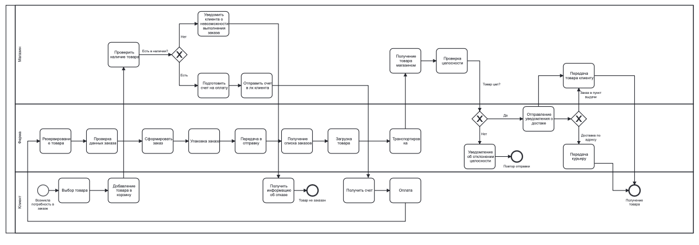
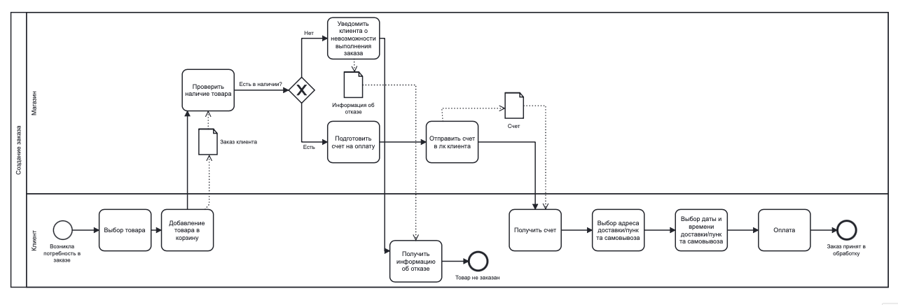
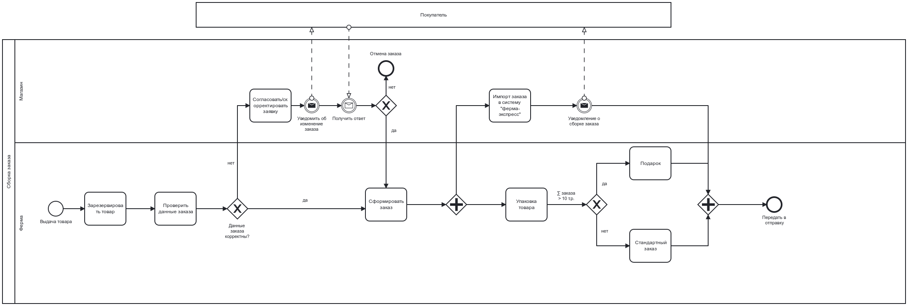
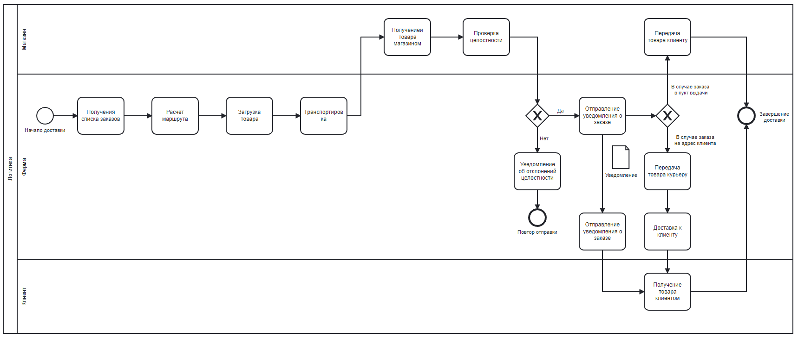

# 2.	ОПИСАНИЕ БИЗНЕС-ПРОЦЕССОВ
## 2.1.	Общая диаграмма процессов

Рисунок 1 – Верхнеуровневая диаграмма бизнес-процессов 

## 2.2.	<Создание заказа>
### 2.2.1. Диаграмма бизнес-процесса "Создание заказа" 

Рисунок 2 – Диаграмма бизнес-процесса "Создание заказа" 

### 2.2.2.	Описание процесса "Создание заказа"  

У клиента возникает потребность в заказе, он заходит на сайт и выбирает товары. Далее он добавляет выбранные товары в корзину для оформления заказа. После добавления товаров в корзину в магазине идет проверка на наличие товаров. В случае если товары есть в наличии, формируется счет на оплату и приходит клиенту в личный кабинет. Клиент выбирает доставку по его адресу или в пункт самовывоза, выбирает удобную дату и время доставки и оплачивает заказ.
В случае, если товара в наличии нет, магазину необходимо уведомить клиента о невозможности выполнения заказа. Клиент получает информацию об отказе. 

### 2.2.3.	Описание функций бизнес-процесса "Создание заказа" 

Таблица 1 – Описание функций процесса 1  
| Создание заказа | Создание заказа |
|----|----|
| **Роли пользователей, участвующих в выполнении функции** | клиент, магазин |
| **Входные данные функции** | Заказ клиента |
| **Описание действия** | Порядок действий при выполнении функции в роли клиента: выбор товара, добавление товара в корзину, получение информации об отказе(в случает если товара нет в наличии), получение счета, выбор адреса доставки/пункта самовывоза, выбор даты и времени доставки/пункта самовывоза, оплата. Порядок действий при выполнении функции в роли магазина: проверка наличия товара, уведомление клиента о невозможностивыполнения заказа(в случае если товара нет в наличии), подготовка счета на оплату, отправка счета на оплату. Необходимые условия: шлюз отвечающий на вопрос: " Есть товар в наличии?". Начальное событие функции: потребность в заказе. Конечное событие функции: принятие заказа в обработку или отказ  в заказе товара (в случае, если товара нет в наличии) |
| **Выходные данные функции** | Информация об отказе, счет |

## 2.3.	<Сборка заказа >
### 2.3.1. Диаграмма бизнес-процесса "Сборка заказа"
 

Рисунок 3 – Диаграмма бизнес-процесса "Сборка заказа"

### 2.3.2.	Описание процесса "Сборка заказа"
После оформления заказа покупателем, начинается процесс сборки заказа. Идет резерв товара в заказе, а затем проверяется список позиций из заказа. Если все товары надлежащего качества, идет формирование заказа, в противном случае идет запрос в магазин на корpектировку заказа и при согласии клиента начинается процесс формирования заказа, при несогласии корректировки, отмена заказа. После того как заказ окончательно сформирован он упаковывается и паралельно происходит импорт заказа в "Ферму экспресс", которая уведомляет клиента о сборке заказа. При сумме заказа выше 10 т.р. клиент получает подарок. После упаковки заказ передают в отправку.

### 2.3.3.	Описание функций бизнес-процесса "Сборка заказа"

Таблица 2 – Описание функций процесса 2  
| Сборка заказа | Сборка заказа |
|----|----|
| **Роли пользователей, участвующих в выполнении функции** | клиент, магазин, ферма |
| **Входные данные функции** | Сборка заказа, информация об изменение заказа |
| **Описание действия** | Порядок действий при выполнении функции в роли фермы: резервируется оплаченный товар, проверяются физические характеристики товара, формируется заказ, упаковка атовара, передача в отправку. Порядок действий при выполнении функции в роли магазина: скорректировать заявку, уведомить о статусе заказа. Порядок действий при выполнении функции в роли клинет: получение уведомления о статусе заказе, получение уведомления об изменение заказа, отправка уведомления о корректировке заказа, отмена заказа.  Необходимые условия: шлюз: "Данные заказа корректны?". Начальное событие функции: Выдача товара. Конечное событие функции: Передать в отправку |
| **Выходные данные функции** | Информация об отказе, уведомление о сборке закза | 

## 2.4.	<Логистика>
### 2.4.1. Диаграмма бизнес-процесса "Логистика"  

Рисунок 4 – Диаграмма бизнес-процесса "Логистика" 

### 2.4.2.	Описание процесса "Логистика"
Транспортировка товара по пунктам выдачи и адресам клиентов. Логистика начинается с получения списка заказов и самих товаров. Далее выстраивается маршрут до пункта назначения с наиболее выгодной время затратой, после происходит загрузка товаров в транспортное средство. Далее транспортировка до пунктов, и выдача товаров магазинам. В магазине проводят проверку целостности товаров с уведомлением фермы. В случе отклонения заказ повторяется, иначе отправляется уведомление о прибытии заказа в магазин клиенту. Клиент забирает товар в магазине, в другом случае товар передается курьеру, с последующей доставкой по адресу клиента, после получения заказ клиентом этап логистики завершается.

### 2.4.3.	Описание функций бизнес-процесса "Логистика"

Таблица 3 – Описание функций процесса 3  
| Логистика | Логистика |
|----|----|
| **Роли пользователей, участвующих в выполнении функции** | клиент, магазин, ферма |
| **Входные данные функции** | Транспортировка товаров |
| **Описание действия** | Порядок действий при выполнении функции в роли фермы: получения списка заказов, расчет маршрута, загрузка товара, транспортировка, уведомление об отклонений целостности или отправление уведомления о заказе, передача товара курьеру, доставка к клиенту. Порядок действий при выполнении функции в роли магазина: получениеи товара магазином , проверка целостности, передача товара клиенту. Порядок действий при выполнении функции в роли клинет: получение уведомления о заказе, получение товара клиентом. Необходимые условия: шлюз отвечающий на вопрос: "В каком статусе находится заказ?". Начальное событие функции: Начало транспортировки. Конечное событие функции: Получение товара клиентом |
| **Выходные данные функции** | Информация об отказе, уведомления о статусе заказа | 

