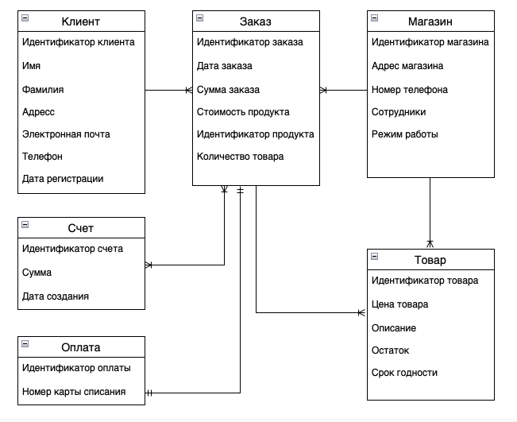
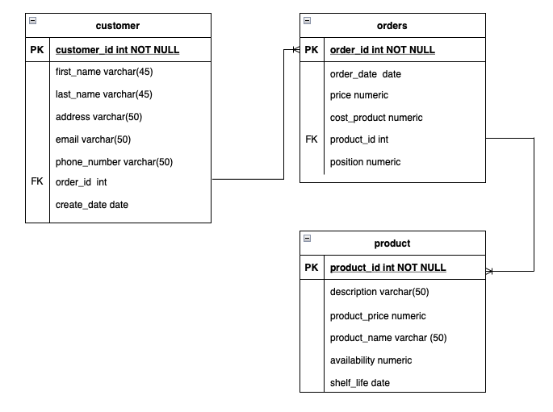
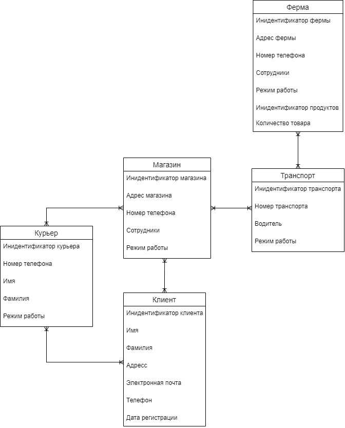
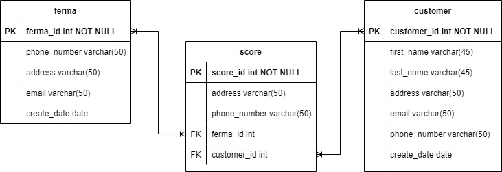

# 3. ОПИСАНИЕ СУЩНОСТЕЙ СИСТЕМЫ

## 3.1.	Сущности предметной области "Создание заказа"
### 3.1.1.	Логическая схема предметной области "Создание заказа" 

  
Рисунок 1 – Логическая схема предметной области "Создание заказа"

Таблица 1 – Описание атрибутов сущности предметной области "Создание заказа"
| № п/п | Атрибут | Обязательность | Тип данных |
|----|----|----|----|
| 1 | Идентификатор клиента | Да | Целочисленный тип данных |
| 2 | Имя | Да  | Строка |
| 3 | Фамилия | Да | Строка |
| 4 | Адресс | Нет | Строка |
| 5 | Эллектронная почта | Да | Строка |
| 6 | Телефон | Да | Строка |
| 7 | Дата регистрации | Нет | Дата |
| 8 | Идентификатор заказа | Да | Целочисленный тип данных |
| 9 | Дата заказа | Нет | Дата |
| 10 | Сумма заказа | Да | Число с произвольной точностью |
| 11 | Стоимость продукта | Да | Число с произвольной точностью |
| 12 | Идентификатор продута | Да | Целочисленный тип данных |
| 13 | Количество товара | Нет | Целочисленный тип данных |
| 14 | Идентификатор магазина | Да | Целочисленный тип данных |
| 15 | Адрес магазина | Нет | Строка |
| 16 | Номер телефона | Да | Строка |
| 18 | Сотрудники  | Нет | Строка |
| 19 | Режим работы | Нет | Строка |
| 20 | Идентификатор товара  | Да | Целочисленный тип данных |
| 21 | Цена товара | Да | Число с произвольной точностью |
| 22 | Описание | Нет | Строка |
| 23 | Остаток | Да | Число с произвольной точностью |
| 24 | Срок годности | Да | Дата |
| 25 | Идентификатор счета | Да | Целочисленный тип данных |
| 26 | Сумма  | Да | Число с произвольной точностью |
| 27 | Дата создания | Нет  | Дата |
| 28 | Идентификатор оплаты | Да | Целочисленный тип данных |
| 29 | Номер карты списания | Да | Целочисленный тип данных |


### 3.1.2.	Физическая модель данных предметной области "Создание заказа" 

  
Рисунок 2 – Физическая модель данных предметной области "Создание заказа" 

Таблица 2 – Описание атрибутов таблицы БД предметной области "Создание заказа" 
| № п/п | Атрибут | Наименование в БД | Обязательность | Тип данных в БД и длина | Комментарии, правила валидации |
|----|----|----|----|----|----|
| 1 | Идентификатор клиента | customer_id | да | int | PK,ограничение - NOT NULL |
| 2 | Имя | first_name | да | varchar(45)  | длина строки не более 45 символов, ограничение -  NOT NULL |
| 3 | Фамилия | last_name | да | varchar(45) | длина строки не более 45 символов, ограничение - NOT NULL |
| 4 | Адрес | adress | нет | varchar(50) | длина строки не более 50 символов |
| 5 | Электронная почта | email | да | varchar(50) | длина строки не более 50 символов, ограничение -  NOT NULL, ограничение - unique|
| 6 | Телефон| phone_number | да | varchar(50) | длина строки не более 50 символов,ограничение -  NOT NULL, ограничение - unique |
| 7 | Идентификатор заказа |order_id | да | int | FK в таблице сustomer и PK в таблице orders, ограничение -  NOT NULL |
| 8 | Дата регистрации | create_date | нет | date | - |
| 9 | Дата заказа | order_date | да | date  | - |
| 10 | Сумма заказа | price | да | numeric | - |
| 11 | Стоимость продукта | amount_product | да | numeric | - |
| 12 | Идентификатор продукта | produkt_id | да  | int | FK в таблице orders и PK в таблице product, ограничение -  NOT NULL |
| 13 | Количество товара | position | нет | numeric | - |
| 14 | Описание | description | нет | varchar(50) | длина строки не более 50 символов |
| 15 | Цена товара | product_price | да | numeric | ограничение -  NOT NULL |
| 16 | product_name | product_name | да | varchar(50) | длина строки не более 50 символов,ограничение - unique |
| 17 | Остаток | availability | нет | numeric | - |
| 18 | Срок годности | shelf_life | нет | varchar(50) | длина строки не более 50 символов |

### 3.1.3.	SQL-запрос для предметной области "Создание заказа"
Создание таблицы покупателей:
```
CREATE TABLE customer (
customer_id int NOT NULL PRIMARY KEY,
first_name varchar(45),
last_name varchar(45),
address varchar(50),
email varchar(50) UNIQUE,
phone_number varchar(50) UNIQUE,
order_id  int FOREIGN KEY,
create_date date);
```
Добавление строк в таблицу customer:
```
INSERT INTO customer (customer_id ,first_name, last_name)
VALUES (‘1’ , ‘Иванов’, ‘Иван’),
       (‘2’ , ‘Петров’, ‘Петр’),
       (‘3’ , ‘Алексеев’, ‘Алексей’);
```
Получить имена и фамилии покупателей покупателей одной строкой:
```
SELECT ‘first_name’ || ‘last_name’ 
FROM customer
```
Получить заказы, где сумма заказа больше 2000 рублей:
```
SELECT * FROM orders  WHERE price > 2000
```
Получить список продуктов с сортировкой цены по убыванию:
```
SELECT product_name, product_price
FROM product 
ORDER BY 2 DESC 
```

## 3.2.	Сущности предметной области "Сборка заказа"
### 3.2.1.	Логическая схема предметной области "Сборка заказа"

  
Рисунок 3 – Логическая схема предметной области "Сборка заказа"


Таблица 3 – Описание атрибутов сущности предметной области "Сборка заказа"
| № п/п | Атрибут | Обязательность | Тип данных |
|----|----|----|----|
| 1 | Идентификатор склада | Да | Целочисленный тип данных |
| 2 | Адресс | Да | Строка |
| 3 | Наименование | Да | Строка |
| 4 | Срок годности | Да | Дата |
| 5 | Количество | Да | Целочисленный тип данных |
| 6 | Идентификатор склада | Да | Целочисленный тип данных |
| 7 | Имя | Да | Строка |
| 8 | Фамилия | Да | Строка |
| 9 | Рабочий день | Да | Логический тип boolean  |

Атрибуты сущностей "Товар", "Заказ" и "Клиент" аналогичны представленным в табл.2 - Физическая модель данных предметной области "Создание заказа"


### 3.2.2.	Физическая модель данных предметной области "Сборка заказа"

  
Рисунок 4 – Физическая модель данных предметной области "Сборка заказа"


Таблица 4 – Описание атрибутов таблицы БД предметной области "Сборка заказа"
| № п/п | Атрибут | Наименование в БД | Обязательность | Тип данных в БД и длина | Комментарии, правила валидации |
|----|----|----|----|----|----|
| 1 | Наименование | name_present | да | varchar(45) | PK,ограничение - NOT NULL |
| 2 | Срок годности	 | shelf_life | да | date |  |
| 3 | Количество | availability | да | int | |
| 4 | Идентификатор сборщика| picker_id | да | varchar(50) | PK,ограничение - NOT NULL |
| 5 | Имя |first_name | да | varchar(50) | FK в таблице сustomer и PK в таблице orders, ограничение -  NOT NULL |
| 6 | Фамилия | last_name | да | varchar(50) | - |
| 7 | Рабочий день	 | work | да | boolean  | - |

Атрибуты сущностей "Товар", "Заказ" и "Клиент" аналогичны представленным в табл. 2 – Описание атрибутов сущности предметной области "Создание заказа"

### 3.2.3.	SQL-запрос для предметной области "Сборка заказа"

 Получить список продуктов, отсортированном по алфавиту от Я до А, из заказа:
```
SELECT product_name
FROM orders
JOIN product USING (product_id)
ORDER BY product_name DESC
```

Посчитать сколько заказов выполнил кладовщик Петров Сергей :
```
SELECT COUNT(order_id)
FROM orders o
JOIN pickers p USING ON o.picker_id = p.picker_id
WHERE first_name = "Сергей" AND last_name LIKE "Петр%" 
```
Посчитать сумму заказов за июнь 2022 года :
```
SELECT Sum(price) as "Сумма заказов за июнь 2022 года"
FROM orders
WHERE extract(year from date_order) = "2022" AND extract(month from date_order) = "6"
```
Определить на какие суммы делались заказы, которые совершил покупатель Иванов Сергей :
```
SELECT order_id, price 
FROM orders o
JOIN customer c ON o.picker_id = c.customer_id
WHERE first_name = "Сергей" AND last_name LIKE "Иван%" 

```

Найти дату заказа, когда был совершен заказ на суммую большую сумму
```
SELECT order_date  
FROM orders
WHERE price = "SELECT MAX(price) FROM order" 

``` 


## 3.3.	Сущности предметной области 
### 3.3.1.	Логическая схема предметной области "Логистика"

  
Рисунок 4 – Логическая схема предметной области "Логистика"

Таблица 5 – Описание атрибутов сущности предметной области "Логистика"
| № п/п | Атрибут | Обязательность | Тип данных |
|----|----|----|----|
| 1 | Идентификатор клиента | Да | Целочисленный тип данных |
| 2 | Имя | Да  | Строка |
| 3 | Фамилия | Да | Строка |
| 4 | Адресс | Нет | Строка |
| 5 | Эллектронная почта | Да | Строка |
| 6 | Телефон | Да | Строка |
| 7 | Дата регистрации | Нет | Дата |
| 8 | Идентификатор продута | Да | Целочисленный тип данных |
| 9 | Идентификатор курьера | Да | Целочисленный тип данных |
| 10 | Адрес магазина | Нет | Строка |
| 11 | Номер телефона | Да | Строка |
| 12 | Сотрудники  | Нет | Строка |
| 13 | Режим работы | Нет | Строка |
| 14 | Идентификатор транспорта  | Да | Целочисленный тип данных |
| 15 | Идентификатор фермы | Да | Целочисленный тип данных |
| 16 | Водитель | Нет | Строка |
| 17 | Номер транспортного средства | Да | Целочисленный тип данных |


### 3.3.2.	Физическая модель данных предметной области "Логистика"

  
Рисунок 5 – Физическая модель данных предметной области "Логистика" 

Таблица 2 – Описание атрибутов таблицы БД предметной области "Логистика" 
| № п/п | Атрибут | Наименование в БД | Обязательность | Тип данных в БД и длина | Комментарии, правила валидации |
|----|----|----|----|----|----|
| 1 | customer_id | customer_id | да | int | PK,ограничение - NOT NULL |
| 2 | first_name | first_name | да | varchar(45)  | длина строки не более 45 символов, ограничение -  NOT NULL |
| 3 | last_name | last_name | да | varchar(45) | длина строки не более 45 символов, ограничение - NOT NULL |
| 4 | address | adress | нет | varchar(50) | длина строки не более 50 символов |
| 5 | email | email | да | varchar(50) | длина строки не более 50 символов, ограничение -  NOT NULL, ограничение - unique|
| 6 | phone_number| phone_number | да | varchar(50) | длина строки не более 50 символов,ограничение -  NOT NULL, ограничение - unique |
| 7 | order_id |order_id | да | int | FK в таблице сustomer и PK в таблице orders, ограничение -  NOT NULL |
| 8 | create_date | create_date | нет | date | - |
