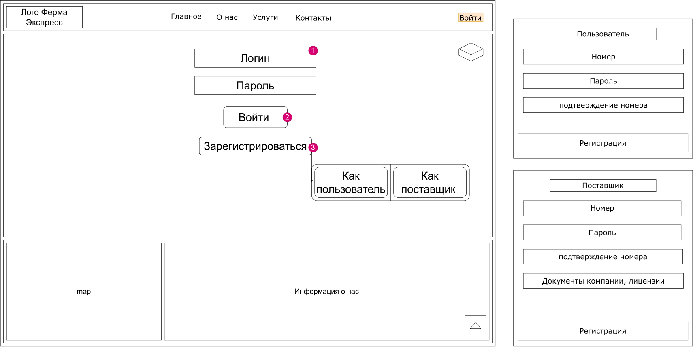
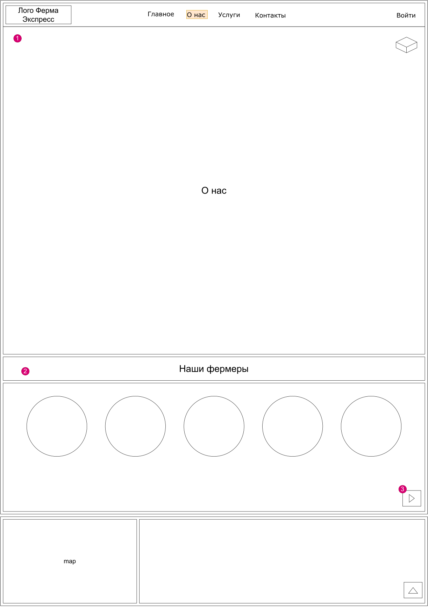
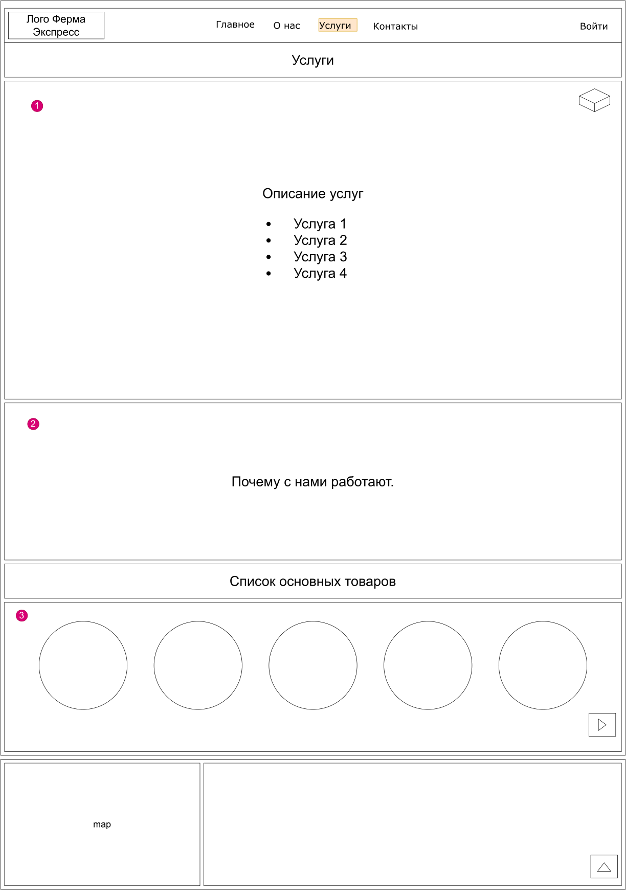
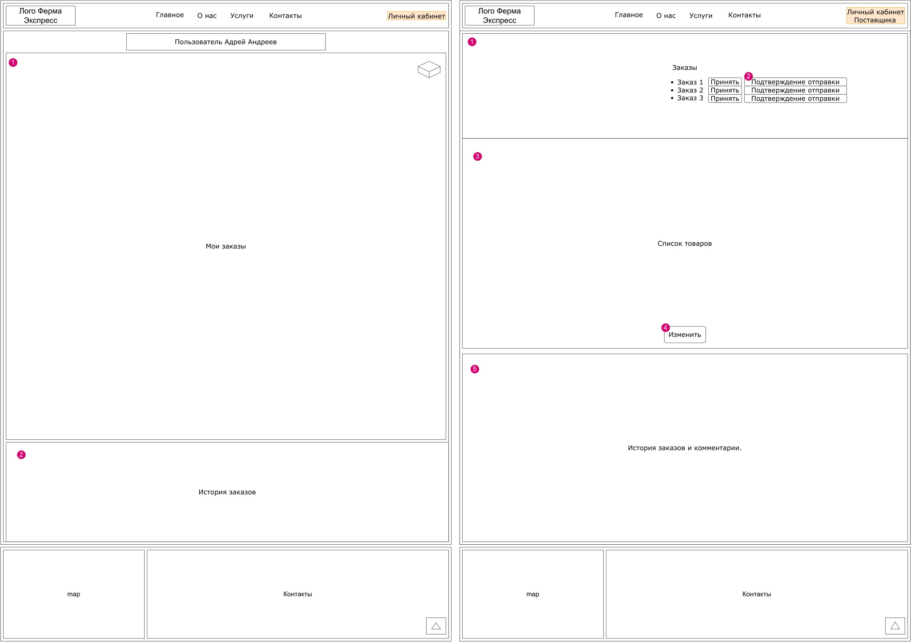

# 1. ОПИСАНИЕ ПОЛЬЗОВАТЕЛЬСКИХ ИНТЕРФЕЙСОВ 
## 1.1.	<Главная>

| № п/п | Наименование элемента | Тип элемента | Назначение элемента | Описание, комментарии, ограничения |
|----|----|----|----|----|
| 1 | *Логотип* | *Шапка сайта* | *Отображает название и символику сайта* |  |
| 2 | *Название страниц с ссылками* | *Кнопки* | *Открытие других страниц по ссылке* | *Среди опций доступны: Свободный переход по страницам с любой из них* |
| 3 | *Корзина* | *Кнопка* | *Открывает дополнительное окно с пеерчнем товаров в корзине* | *Среди опций доступны: Удаление товаров, Оплата товаров, Выбор места доставки, выбор даты доставки* |
| 4 | *К товарам* | *Кнопка* | *По нажатию происходит скрол страницы до списка товаров* |  |
| 5 | *Информация по фермерам* | *Поле с описанием* | *Красткое описание услуг фермера с изображением* |  |
| 6 | *Категории товаров* | *Кнопки* | *По нажатию происходит сортировка товаров по выбранной категории* |  |
| 7 | *Сортировка* | *Кнопка* | *По нажатию происходит открытие окна с типами сортировки и возможностью отмены* |  |
| 8 | *Список товаров* | *Товары* | *Товары с коротким описанием по нажатию открывается окно с описанием* | *Среди опций доступны: Выбор количества товара, добавление товара в корзину, выбор подписки на товар* |
| 9 | *Карта* | *Окно карты* | *Карта с пунктами выдачи, для ознакомления* | *Среди опций доступны: Откртыие карты в полном формате, выбор адреса пункта выдачи, внесение адреса доставки* |
| 10 | *Контакты* | *Поле с контактами* | *Полес с информацией для связи с администратором* |  |
| 11 | *Вернуться к началу* | *Кнопка* | *По нажатию происходит возвращение к началу страницы* |  |

## 1.2.	<Войти>

| № п/п | Наименование элемента | Тип элемента | Назначение элемента | Описание, комментарии, ограничения |
|----|----|----|----|----|
| 1 | *Поля логин, пароль* | *Поля для заполнения* | *Поля заполняемые пользователем, для входа в личный кабинет* | *Среди опций доступны: Ввод данных, удаление данных* |
| 2 | *Войти* | *Кнопка* | *По нажатию происходит вход в систему* |  |
| 3 | *Зарегистрироваться* | *Кнопка* | *По нажатию открывается меню регистрации* | *Среди опций доступны: Регистрация по номеру телефона, заполнение полей регистрации* |

## 1.3.	<О нас>

| № п/п | Наименование элемента | Тип элемента | Назначение элемента | Описание, комментарии, ограничения |
|----|----|----|----|----|
| 1 | *О нас* | *Поле с информацией* | *Информирование о компании* |  |
| 2 | *Наши фермеры* | *формы с краткой информацией* | *Формы с описанием услуг фермера и ссылкой на товары* |  |
| 3 | *Скрол вправо* | *Кнопка* | *Проматываениме фермеров для выбора* | *Среди опций доступны: при скроле появляется кнопка влево* |

## 1.4.	<Услуги>

| № п/п | Наименование элемента | Тип элемента | Назначение элемента | Описание, комментарии, ограничения |
|----|----|----|----|----|
| 1 | *Услуги* | *Поле с ссылками* | *Перечисление услуг с ссылками* | *Среди опций доступны: при нажатии осуществляется переход к пункту* |
| 2 | *Почему с нами работают* | *Поле с информацией* | *Описание причин заказывать товар у нас* |  |
| 3 | *Список товаров по категориям* | *Список с ссылками* | *Переход к товарам по направлению* |  |

## 1.5.	<Личный кабинет>

| № п/п | Наименование элемента | Тип элемента | Назначение элемента | Описание, комментарии, ограничения |
|----|----|----|----|----|
| 1 | *Мои заказы* | *Поле с пеерчнем заказов* | *Ознакомление с седланными заказами* | *Среди опций доступны: Проверка статуса заказ и его отслеживание* |
| 2 | *История заказов* | *Поле с перечнем выполненных заказов* | *Информация по выполненным заказам* | *Среди опций доступны: Возможность оставлять комментарий* |
| 3 | *Заказы* | *Поле с пеерчнем заказов от покупателя* | *Ознакомление с новыми заказами* |  |
| 4 | *Принять, отправить* | *Кнопки* | *По нажатиую на принять, поставщик подтверждает заказ для его последующей отправки* |  |
| 5 | *Список товаров* | *Поле с списком предоставляемых товаров* | *Ознакомление с списком товаров* |  |
| 6 | *Изменить* | *Кнопка* | *Изменение списка товаров, добавление, удаление* |  |
| 7 | *История выполненных заказов* | *Поле с перечнем выполненных заказов* | *Информация по выполненным заказам* | *Среди опций доступны: Возможность ознакомиться с комментариями оставленными пользователями* |
